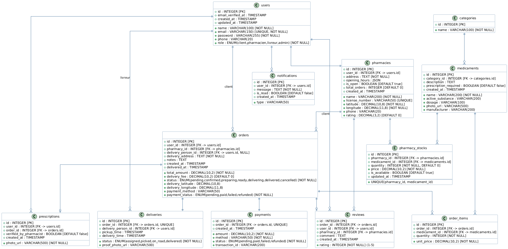

## 2. Étude technique & choix de stack

### 2.1 Backend – Laravel

**Choix retenu :** Laravel 10 (PHP 8.2)

**Raisons :**
- ✅ **Compétences de l’équipe** – Plusieurs membres ont déjà travaillé avec Php en cours.
- ✅ **Documentation abondante** – Laravel dispose d’une des documentations les plus claires et de milliers de tutoriels.
- ✅ **Écosystème riche** – Outils intégrés (Eloquent ORM, Sanctum pour l’auth, Queues, Notifications).
- ✅ **Performance suffisante** – Capable de gérer plusieurs centaines de requêtes/seconde avec un bon serveur.
- ✅ **Déploiement simple** – Compatible avec Docker, Forge, Vapor.

**Alternatives écartées :**
- ❌ **NestJS** – Moins maîtrisé par l’équipe, courbe d’apprentissage plus raide.
- ❌ **Spring Boot** – Aucune connaissance dans l’équipe, trop risqué pour un projet de 2 mois.

---

### 2.2 Frontend Web – React

**Choix retenu :** React 18 + Vite

**Raisons :**
- ✅ **Compétences de l’équipe** – Plusieurs membres ont déjà utilisé React (cours, projets perso).
- ✅ **Écosystème et librairies** – Grand choix de composants, intégration facile avec Laravel API.
- ✅ **Performance** – Vite offre un développement ultra-rapide et des builds optimisés.
- ✅ **Employabilité** – React est un atout majeur sur le CV.

---

### 2.4 Base de données – PostgreSQL

**Choix retenu :** PostgreSQL 15

**Raisons :**
- ✅ **Open source & robuste** – Moteur relationnel mature, ACID, très fiable.
- ✅ **Support géospatial** – Extension PostGIS indispensable pour la géolocalisation des pharmacies et livreurs.
- ✅ **JSON support** – Peut stocker des données semi-structurées (ex: horaires d’ouverture).
- ✅ **Performance** – Optimisé pour les requêtes complexes et les gros volumes.

**Alternatives écartées :**
- ❌ **MySQL** – Moins performant sur les requêtes spatiales.
- ❌ **MongoDB** – Pas adapté aux relations complexes (commandes, stocks, etc.).

---

### 2.5 Cache – Redis

**Choix retenu :** Redis 7

**Raison :**  
- Cache des sessions, des requêtes fréquentes (recherche, liste de médicaments).  
- Files d’attente pour les tâches asynchrones (envoi d’emails, notifications).  
- Laravel intègre Redis nativement.

---

### 2.6 Services externes

| Service | Usage | Alternative écartée |
|--------|-------|---------------------|
| **Google Maps API** | Géolocalisation, calcul distances, affichage carte | OpenStreetMap (moins précis, moins de docs) |
| **MTN Mobile Money API** | Paiement mobile | Orange Money API (intégré en parallèle) |
| **Cloudinary** | Upload et stockage d’images (ordonnances, preuves livraison) | AWS S3 (plus complexe, pas de transformation d’image) |
| **SendGrid** | Envoi d’emails transactionnels (100/jour gratuit) | Mailgun, SMTP |
| **Firebase Cloud Messaging** | Notifications push | OneSignal (payant au-delà d’un seuil) |

---

### 2.7 Infrastructure et déploiement

- **Conteneurisation** : Docker Compose (environnement de développement identique pour toute l’équipe).
- **CI/CD** : GitLab CI (tests automatisés, déploiement continu).
- **Hébergement** : VPS (DigitalOcean / OVH) ou Plateform.sh (scalable).
- **Monitoring** : Prometheus + Grafana (métriques serveur, logs).

---

### 2.8 Justification globale de la cohérence de la stack

- **Laravel + React** est une stack moderne, largement adoptée, et **parfaitement maîtrisée par l’équipe**.
- Le fait que plusieurs membres connaissent déjà **Laravel et React** permet d’attaquer le développement immédiatement, **sans phase d’apprentissage**.
- **Flutter** assure une expérience mobile de qualité tout en mutualisant le travail sur iOS et Android.
- **PostgreSQL + PostGIS** est le choix standard pour toute application de géolocalisation.
- **Docker** garantit que tout le monde travaille dans le même environnement, évitant les “ça marche sur ma machine”.
- L’ensemble est **réaliste pour 4 mois de développement** avec une équipe de 5 personnes.

## 3. Modèle de Données

Le schéma complet de la base de données est disponible ci-dessous :

Nous avons modélisé 12 tables principales :
- **users** : Gère tous les utilisateurs (clients, pharmaciens, livreurs, admins) via un champ `role`
- **pharmacies** : Informations des pharmacies (géolocalisation, horaires)
- **medicaments** : Catalogue des médicaments
- **pharmacy_stocks** : Table pivot qui lie pharmacies et médicaments (avec prix et quantité)
- **orders** : Commandes clients
- **order_items** : Détails des commandes (lignes)
- **deliveries** : Gestion des livraisons
- **payments** : Transactions de paiement
- **prescriptions** : Ordonnances uploadées
- **notifications** : Système de notifications
- **reviews** : Avis clients
- **categories** : Catégories de médicaments

Les relations clés :
- 1 user → N orders (un client passe plusieurs commandes)
- N pharmacies ↔ N medicaments (via pharmacy_stocks)
- 1 order → 1 delivery (relation 1-1)
- 1 order → 1 payment (relation 1-1)